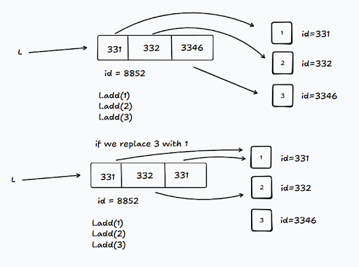
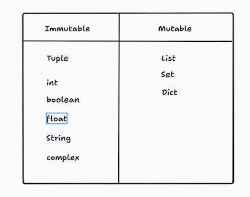
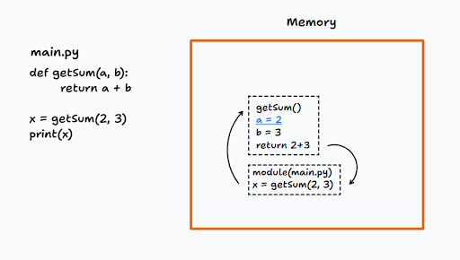
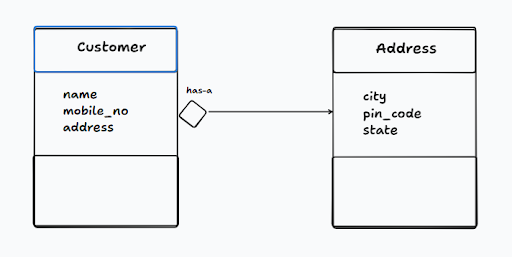
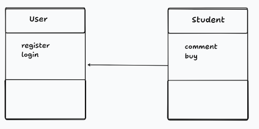
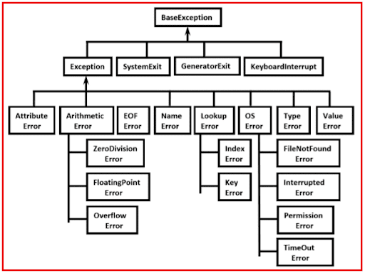

# Python Notes

**print() function**
The print function can take in multiple strings and multiple data types at once and prints them separating with a space.
Ex: print(“talha”) → talha, print(“talha”, “yaseen”, “taha”), print(“talha”, 25, “yaseen”, 21, 44) all these are valid.

**The print function can take the following arguments:**
A separator: By default it's a space, but we can change this to anything of our choice like ‘-’, ‘/’ etc. ex: print(“talha”, 25,sep=‘:’) → this will print talha:25
end: we can define where the line should start after printing something, by default it is set to new line or ‘\n’

## Data types

1. Basic types: int, float, complex, boolean, string
2. Container types: list, tuple, set and dictionary
3. User defined types: classes

int can store any integer upto 10^308, basically this means the number 1 can be followed by 308 zeros, after this will be infinity.

float can store decimal numbers like 1.2, 4.5 etc and its range is also huge 1.7e308 i.e. 1.7 \* 10^308, it is 170 followed by 308 zeros

Boolean in python is True or False

String in python can be written in single inverted commas(‘ ’), double inverted commas(“”) and also triple inverted commas(“”” ”””), there is no different type for a char in python.

Java has a limit for every primitive data type like int, float, double, long etc

Container types are used to store data of different types, lists are the same as arrays in java but here it can store multiple types in it, unlike java where an array can store data of only a single type.

- Tuple is the same as a list.
- Set is used to store unique elements, it will not store duplicates
- Dictionary is used to store key value pairs.

## Variables in python:

Variables are containers for future use. Ex: we design
In python there is no declaration of variables like in other languages like java where we declare a variable like int num = 4. Here, we are specifying the data type of variable num, but this is not required in python, we can just write num = 4 and the python runtime will recognize this as a num/integer.

Also declaring the type before a variable is called static typing and not declaring is called dynamic typing.

In python the data types are interpreted during runtime.

## Dynamic Binding

In python the variables can change data types, i.e. if a variable name is initialized with a string ex: name = ‘taz’, then we can reinitialize it to name = 2 an integer type.

But in Java/C this is not possible if a variable is of type int, then it can only be re-initialized with a type int, this is called static binding.

So, basically in python the data of a variable can keep changing.

**Different ways of declaring variables in python**
a=1;b=2;c=3 → multiple variables in a single line.
a,b,c = 1, 2, 3 → multiple variables and their values separated by commas
a=b=c = 3 → all three a, b and c will have its value as 3

## How python code is executed

Python is an interpreted language, i.e. the code is first converted into byte code by the compiler and the PVM (python virtual machine) interprets the bytecode to machine code.

Ex: A mediator b/w two people speaking russian and english, the mediator understands/interprets russian and passes on to the english person, he first hears then conveys.
Similarly the interpreter interprets a line and then processes it to machine code and runs it.

Unlike Java, which is a compiled language, it gets compiled to bytecode by the compiler first fully and then the bytecode is converted to machine code by jdk/jit at runtime.

**CPython is the reference implementation of Python. When you run a module:
It consists of a Parser, a Compiler and a Runtime and many other things like the standard library.**

- Parse → AST (tree of syntax nodes).

- Compile → bytecode packed into code objects (module code object plus one for each function/class/comprehension).

- Execute those bytecode instructions in the CPython virtual machine (an interpreter written in C).

- The module’s bytecode may be cached as a .pyc in **pycache** for faster future imports.

**In Short: Python (CPython) compiles source to bytecode and the CPython VM interprets that bytecode. So CPython has both the compiler and the interpreter.
A language like C is directly compiled to machine code hence it is faster, it skips the step of interpretation.**

**Simplified view of CPython architecture:**

```
CPython = {
    "Parser":       "Converts source to AST",
    "Compiler":     "AST → Bytecode (.pyc files)",
    "Interpreter":  "Bytecode → Execution (C VM)",
    "Memory Mgmt":  "Reference counting + GC",
    "Standard Lib": "Batteries included",
    "C API":        "Interface for C extensions"
}
```

**There are other runtimes to run python code other than CPython, one is PyPy it is does the same steps as CPython but it has a JIT compiler which hot codes any repetitive code to machine code to avoid re interpreting the same code again and again.**

```
PyPy = {
    "RPython Toolchain": "Translates RPython → C",
    "Python Interpreter": "Written in RPython",
    "JIT Compiler":       "Runtime optimization",
    "GC":                 "Different garbage collector",
    "Compatibility":      "cpyext for C extensions"
}
```

**Points to remember:**
The python virtual machine CPython has both compiler and interpreter. The source code is
compiled to bytecode by the compiler then the interpreter executes the bytecode.

- Python, Java is a compiled and interpreted language.
- C, Rust and Go are only compiled languages, i.e. their compiler directly compiles the source code to machine code no bytecode.

## Keywords:
Keywords are reserved words, these words cannot be used as variable names, function names etc in a program. Keywords cannot be changed. Ex: for, while, print etc
There are 33 keywords in python.

## Identifiers:
Identifiers are names used to identify a variable, function, class, module or an object.
Rules for naming identifiers:
Can only start with an alphabet or an _.
Followed by 0 or more letters, _ and digits
Keywords cannot be used as identifiers.

Python is a case sensitive language, it means there will always be difference b/w false and False as **False** is a keyword.

## Lecture - 6
**What is the input method ?**
input() method, this is used to take input from the user. It takes in an argument called prompt.
Ex: input(prompt=“Your name”)/input(“Your name”) → this will print Your name on the console and give a blinking cursor to the user.

Also the input method takes prompt as a string, so even if we enter int, float etc it will consider it as a string.
Ex: If we write a program to add two numbers by taking the user input
num_1 = input(“Enter the first number: ”)
num_2 = input(“Enter the second number: ”)
print(num_1 + num_2)
When user enters numbers 1 and 2 in the console, the print function will print 12, since the prompt takes in a string and string is a universal type in python i.e. any data type can be stored as a string but not the vice versa, 
So instead of printing 1+2 = 3 it is giving 12 because since both num_1 and num_2 are prompts which are strings a string concatenation takes place.

## Lecture - 7
Type Conversion
- There are two types of type conversions in python
- Implicit conversion
- Explicit conversion 

**Implicit Conversion**
This conversion is done by python without specifying. Ex: 2 + 4.5 = 6.5, here an int is added with a float, python automatically gives a floating result.

**Explicit Conversion**
Every data type has a type conversion method in python.
Ex: int(4.5) → this will give 4, similarly, float(3) → 3.0, str(4) → ‘4’

**Note:** Also type conversion is not permanent i.e. if a = ‘3’, int(a) → this will give 3 but if we print a it will still be string ‘3’. Hence a conversion method returns a new value, i.e. int(a) will give a new value 3 which can be stored in another variable.

## Lecture-8
Literal is a value given to a variable. Ex: num = 2, here 2 is a literal, name = ‘taz’ here taz is a literal.

In python we have 4 types of literal, numeric literals, string literals, boolean literals and special literals.

### None in python
We know that we cannot simply declare a variable in python without a literal, this is where we can None.

None is used to specify that there is no value or simply nothing. Similar to null in Java.
In Java this is possible int x; without specifying a literal like 0 or 1 etc. This is possible because internally int’s value is 0.

In python this is not the case, we cannot just leave it like x or num etc hence we do 
num = None.

## Lecture-9
Operators in python
### Arithmetic Operators:
1. +, used to add numbers
2. -, used to subtract two numbers
3. /, used to divide two numbers, gives a floating value, ex: print(5/2) → gives 2.5
4. %, gives the remainder of a division
5. *, used to multiply two numbers
6. //, integer division operator, gives out an integer value after a division. print(5//2) → prints 2
7. **, it used to calculate n power x, ex: 5 ** 2 = 25, it basically means 5 power 2.

### Comparison Operators:
1. `>` - used to check if a > b
2. < - used to check if a < b
3. `>=` : used to check if a > or = b
4. <= : used to check if a < or = b
5. == : used to check if a == b
6. != : used to check if a != b

### Logical Operators:
1. or - used to execute an operation if one among the two values is true. ex: if a = 2 or b =1 print(‘hi’)
2. and - used to execute an operation if both values are true ex: if a and b == 2 print(2);
3. not - 

### Bitwise Operators:
These operators are used and work only on binary numbers.

1. & : this is different from logical and. Ex: if we do print(2 & 3) → this gives 2.
because, 0 1 0
                1 1 1
                —----
                0 1 0 → this is the binary of 2, hence we get 2.
In & operation if any one bit among two is 0 then its result is 0, if both are 0 then it is 0 or if both bits are 1 then result is 1
| : this is bitwise or (|) unlike logical or, it is also used to perform operations b/w two binary numbers.
0 1 0
1 1 1
—---
1 1 1 → This is the binary of 3.
	In | if one digit is 1 or both digits are 1 then the ans is 1, if both digits are 0 then ans is 0.

2. `>>` : right shift and, learn about this
3. << : left shift and
4. ~ : one's complement operator.

### Assignment Operator:
1. = : this is used to assign a value to a variable, like a=1, name = ‘taz’ etc.
2. += : this is used to increment a value, ex: a += 1, it is the same as a = a + 1.
3. -= : similar as above but decrement.
4. *= : used to multiply
5. /= : used to divide a num
**a++, ++a, --a, a-- is not allowed in python to increment.**

### Identity Operator:
is : it is used to check if two values are stored in the same memory location or not, or we can also say if two different variables are addressing to the same memory location or not.
Ex: a = 1, b = 1, print(a is b) → this will print True, as both a and b are pointing to the same 1 in the memory.

a = [1, 2, 3], b = [1, 2, 3], print(a is b) → this will print false, because incase of a list even if they look identical but on every new assignment a new object is created in the memory hence b will have a different memory address to a.

Hence is used to check if two variables are addressing the same object or different ones.

### Membership Operators:
in : it is used to check if some value exists in another value. Ex: print(‘D’ in “Delhi”) this will print True.

similarly a = [1, 2, 3], print(2 in a) → True.

We can also do, (2 not in a) → this will print False.

## Lecture - 23
### String functions:
**Common functions:** These functions are available in other data structures as well like lists, tuples etc.

1. len() - gives the len of a string
2. max() - gives the max ASCII val character in a string
3. min() - gives the min ASCII val character in a string
4. sorted() - sortes the characters in a string according to the ASCII value and returns a list of separate characters of that string.
ex: msg = “dcba” → sorted(msg) gives [‘a’, ‘b’, ‘c’, ‘d’]
We can also sort a string in descending order using the reverse argument in the sorted function.
sorted(msg, reverse=True) will return a list of sorted characters in descending order according to their ASCII values.

5. capitalize() - It changes the first char of a string to capital letter. 
ex: c = “kolkata”, c.capitalize() → this will not modify c, but it will return a new copy of c whose first letter will be capital, ex: Kolkata

6. title() - It changes the first char of every word in a sentence to capital.
ex: c = “it is raining today”, c.title() will return a new string/sentence which will be
“It Is Raining Today”

7. upper() - It returns an uppercase copy of the given string.
ex: c = “kolkata”, c.upper() → will return “KOLKATA”

8. lower() - It is similar to upper, just that it returns a lowercase version of the given string.

9. swapcase() - It gives the count of a substring inside a string. 
ex: c = “kolkata”, c.count(k) → this will return 2, because there are 2 ks.

10. find() / index() - It returns the index of a character in the string. If there are many characters as the given character, then it will return its first occurrence.
ex: c = “kolkata”, c.find(k) → it will return 0.

we can also find a word, it will return the index of the first character of the word.
ex: c = “it is raining today”, c.find(“raining”) → this will return 6, r of raining is starting at index 6.

If it does not find the target word or character it will return -1.
The only difference index() has is, if it does not find the target then it will throw an error.

11. endswith()/startswith()
c = “it is raining”, c.endswith(“ing”) → this will return true, similarly startswith().

12. format()
It is used to fill blanks in a string, it can be used in many ways.
ex: 
c = “Hello my name is {} and I am {} years old”
c.format(“Talha”, 25), this will return a new string which will have talha and 25 in it in place of the curly braces.
ex: “Hello my name is Talha and I am 25 years old”

c = “Hello my name is {1} and I am {0} years old”
c.format(“Talha”, 25)
	“Hello my name is 25 and I am Talha years old”
	
	c = “Hello my name is {name} and I am {age} years old”
c.format(name = “Talha”, age = 25)
	“Hello my name is Talha and I am 25 years old”

Also, the format method can take any number of arguments, and it is not necessary that all these arguments must be used inside the sentence; we can choose only the ones which we want.

ex: 
	c = “Hello my name is {name} and I am {weight} years old”
c.format(name = “Talha”, age = 25, weight=70)
	“Hello my name is Talha and I am 70 years old”

13. split() - it splits the words in a sentence based on a given substring, a special character or space, and returns the separated words in a list.
ex: c = “192.0.22.200”, c.split(“.”) → [“192”, “0”, “22”, “200”]
If nothing is passed it will split the sentence based on space,
ex: c=“it is raining today”. c.split() → [“it”, “is”, “raining”, “today”]

14. join() - it is opposite of the split function, it joins the given words in a list based on a given separator and returns a string. 
ex: list = [“it”, “is”, “raining”, “today”]
Syntax = separator.join()
“ ”.join(list) → “it is raining today”
“/”.join(list) → “it/is/raining/today”

15. replace() - it replaces a given target with another value which should be given.
ex: c = “my name is talha”, c.replace(“talha”, “yaseen”) → it will return a string in which 
talha will be replaced by yaseen.

16. strip() - it removes the leading and trailing spaces in a string and returns a new string.
ex: c = “   talha  ”, c.strip(c) → returns “talha”

**Validation Functions** - These return boolean values.
1. isalpha() - checks if a string is only alphabets and returns true or false.
ex: c=”talha”, c.isalpha(), returns true.
2. isalnum() - checks if a string consists of words and nums.
c = “FLAT20”, c.isalnum() → true, isalpha will return false.
3. isdigit() - checks if a string is a number, if yes returns true or false.
c = “22”, c.isdigit() returns true.

## Lecture - 24
### Lists
### Difference b/w Array and List.
Array can store data of a single type. An array can only store integer or character or string, it cannot store multiple data of multiple types.

Array stores its data in a sequence in memory, this is not the case with lists, hence arrays are faster and lists are slower.

list can store data of multiple types.

### Creating a list:
l = [], l = list()

l = [1, 2, 3, 4] list store data of type int
l = [1, 2, “talha”, false] list storing data of different types.

l = list(“talha”) this will create a list, l = [“t”, “a”, “l”, “h”, “a”]

### 2D lists
l = [
	[1, 2, 3],
	[4, 5, 6]
]

Lists inside a list.

### Accessing elements of a list:
l = [1, 2, 3]
l[0] → 1
l[-1] → 3 last element of the list
l[::-1] → reversing a list [3, 2, 1]

**Lists are mutable in python, meaning they can be modified.**
ex: 
l = [1, 2, 3], l[2] = 4, now l will be [1, 2, 4]

**We can modify them via slicing as well,**
l = [1, 2, 3, 4], l[1:2] = [200, 300], now l will be [1, 200, 300, 3, 4]

One thing to notice is, it is replacing the 1st index element 2 with 200 and adds 300 to l without replacing 3. Because [1:2] means 2 the upper bound is not considered so technically we are only replacing 1 element i.e. 2 at 1st index and since our replacement array has 2 elements 200 and 300, after replacing 1 element 2 with 200 instead of ignoring 300 it adds 300 to l.

### Adding elements to a list
We have 3 functions:
1. append()
2. extend()
3. insert()

**append()** - will always add a single item at the end of a list.
ex: l = [1, 2, 3, 4]
l.append(5), now l will be [1, 2, 3, 4, 5]

l = [1, 2, 3, 4], l.append([5, 6]), l = [1, 2, 3, 4, [5, 6]] will always append a single item so it adds the whole list itself.
l.append(“goa”), l = [1, 2 ,3, 4, “goa”]

**extend()** - will always add multiple items to the end of a list. extend() only takes iterables as arguments, like lists, tuples, strings etc.
ex: l = [1, 2, 3], l.extend([4, 5]) → l = [1, 2, 3, 4, 5]
l.extend(1) **this is not possible, but l.extend(“a”) // this is possible as a string is iterable.**
l = [1, 2, 3], l.extend(“goa”) → l = [1, 2, 3, “g”, “o”, “a”]

**insert()** - this is used to add an element at a desired position
ex: l = [1, 2, 3], l.insert(index, value) 
l.insert(1, 4), l = [1, 4, 2, 3]

### Deleting From a List
We have 4 ways to delete from a list:
1. del - it is a keyword
2. remove()
3. pop()
4. clear()

del:
l = [1, 2, 3]
del l , this will remove the whole of l itself, the list won’t exist.

We can also remove a part of it, 
l = [1, 2, 3, 4, 5]
del l[1:3], it will remove the elements from 1 excluding the upper bound.
l = [1, 4, 5]

remove():
If we don’t know the index we can use remove and pass in the target, it will remove by locating its existence.
l = [1, “taz”, 2, 3]
ex: l.remove(“taz”) → l = [1, 2, 3]

pop():
It will remove the last element in a list.
l = [1, 2, 3, 4, 5]
l.pop()
l will be [1, 2, 3, 4]

clear(): It will empty the list.
l = [1, 2, 3, 4]
l.clear()
l will be []


### Operations on Lists
1. Concatenation: We can concatenate 2 lists
ex: l1 = [1, 2, 3], l2 = [4, 5, 6]
l1 + l2 will create a new list [1, 2, 3, 4, 5, 6], since it will create a new list we need to store it in a variable,
l3 = l1+l2
print(l3) → [1, 2, 3, 4, 5, 6]

2. Multiplication: we can multiply a list
ex: l1 = [1, 2, 3]
l1 * 3, it will create repeat the same list 3 times
l1 = [1, 2, 3, 1, 2, 3, 1, 2, 3]

3. Membership operator or in: It is used to check if an element exists in a list or not and also in loops
l = [1, 2, 3, 4]
print(3 in l) this will print true.

for i in l:
	print(i) this will print 1, 2, 3, and 4

### Functions on Lists:
1. len() - will return the len of a list
ex: l = [“taz”, 1, 2, 3], len(l) = 4

2. max() - will return the max elem in the list, but the list must contain numerical values only. 
ex: l = [1, 2, 3], max(l) will return 3

3. min() - returns the min number in a list of numbers.

4. sorted() - sorts a list in ascending order, we can also sort a list in descending order by passing the reverse argument = True
ex: l = [1, 3, 2, 4]
sorted(l) it will return a new list [1, 2, 3, 4]
sorted(l, reverse=True) it will return a new list [4, 3, 2, 1]

So, sorted is not a permanent operation on a list.

5. sort() - it does the same thing like sorted(), but it does not return a new list, it changes the existing list. Hence, sort is a permanent operation.
l.sort()
l.sort(reverse=True)

6. index() - it gives the element present at an index.
l = [1, 2, 3, 4], l.index(2), this will return 3.

**Functions like len(), sorted(), max(), min() are global functions, can be used on any iterable, will return a value, like sorted() will return a new list, tuple etc whichever is passed to it.**

**But methods like sort(), index() etc are specific to a class like list, x = [2, 3, 1], x.sort() will sort x in memory it won’t return a new object.**

**How does the sort() function sort a list of lists ?**
Ex: temp_list = [[1, 3, 2], [1, 2, 3], [2, 3, 1], [2, 1, 3]]
temp_list.sort()
print(temp_list) → [[1, 2, 3], [1, 3, 2], [2, 1, 3], [2, 3, 1]]

It does this using lexicographical order.

**Problems:**
1. turn a sentence into title without using title
def title1(s:str):
    l = s.split()
    
    newL = []
    for i in l:
        newL.append(i.capitalize())
    
    return " ".join(newL)
    
s = "is it sunday tomorrow"
newL = title1(s)
print(titles)

2. Return the name from an email
We first find the @ character in the string
Then we will slice the string from 1st to @’s index
return s[0: s.find(@)]

## Lecture - 25
### Tuples
They are same as lists but with slight differences

### Creating a Tuple:
t = ()
t = tuple()
t = (1, 2, 3)
t = ([1, 2, 3, 4])

All the above will create a tuple,

**t = (1), creating a tuple with a single item, will not create a tuple unless we use a comma after the single element.**
So, t =(1,) will create a tuple, similarly, t = (“taz”, )

### Accessing Elements in a Tuple:
t = (1, 2, 3, 4)
t[0]
we can also access via slicing, t[0:2], the upper bound will be excluded

t[-1] , will give the last elem


### Modifying/Editing a Tuple:
This is not possible because unlike list, tuple is immutable i.e. once a tuple is created it cannot be modified, we cannot add or delete elements from a tuple. 
Similar to Strings, strings are also immutable. 
s = “talha”, 
s+”mohammed”
print(s) → this will print “talha” only, because strings are immutable, **the concatenation will create a new object of string**, which will be talhamohammed

**We can delete a tuple object but we cannot delete anything inside a tuple.**
so,
t1 = (1, 2, 3, 4)
del t1, this will delete the t1
del t1[-1] this will not be possible, because tuples are immutable.

### Operations on Tuples:
1. Concatenation:
We can concatenate 2 tuples, it will be a new object with the values of t1 and t2, but t1 and t2 will remain the same.
So, t1 = (1, 2, 3), t2 = (4, 5, 6)
t3 = t1+t2 
print(t3) → (1, 2, 3, 4, 5, 6)

2. Multiplication:
t1 = (1, 2, 3)
t3 = t1 * 3, this will create a new tuple in which t1 will be repeated 3 times
print(t3) → (1, 2, 3, 1, 2, 3, 1, 2, 3)

3. Membership operator or in: same as in lists

### Functions of Tuples:
1. len() : returns len of the tuple
2. min(): returns min number in a tuple
3. max(): returns max number in a tuple
4. sum(): returns sum of all numbers in a tuple
5. sorted(): sorts a tuple in ascending order but converts it to a list

Tuples are read only data type, because tuples are immutable, write operations are not possible once a tuple is created.
Wherever data integrity is important we can use a tuple.

## Lecture - 26 
### Sets
Sets do not allow duplicates
Sets have no indexing/slicing
Sets don’t allow mutable data types
Set itself is a mutable data type.

### Creating a Set
s1 = set()
s1 = {1, 2} **both set and dictionary or map are represented with curly braces.**

**Note:** An empty set cannot be created by doing s1 = {}, this will by default create a dictionary. If we want to create an empty set we have to create by doing s1 = set(), using the constructor set().

Sets can also have mix of different data types:
s1 = {1, True, “Hello”, 4.5}

**Sets cannot store mutable data types because set itself is a mutable:**
It cannot store a list, s1 = {[1, 2, 3]} this is not possible
It can store a tuple, or a string because these are immutable, s1 = {(1, 2, 3), “Hello”}

Also, a set automatically stores elements in sorted order:
s1 = {2, 3, 1}
print(s1) → this will print {1, 2, 3}

Similarly, s1 = {(1, 2, 3), “Hello”}
print(s1) → this will print {“Hello”, {1, 2, 3}}

This happens because the set internally uses hashing, the algorithm creates a hash for each element, and the elements are arranged according to their hash values.

Also, sets have no indexing, sets do not follow the order of elements in which they are sent into a set.

We cannot create 2D or 3D sets, because set is a mutable type and set does not store mutables.
s1 = {{1, 2}, {3, 4}} // this is not possible.

### Accessing Items in a Set:
We cannot access items in a set similarly we cannot delete items from a set, Indexing and slicing will not work.

We might think we will turn the set to a list, modify the list and turn it back to a set, this will create a new set with the modification but the original one will still remain the same.

Even though set is a mutable type we cannot make modifications by replacing one element with another from it.

### Adding and Deleting items from a Set:
We use the add() function to add an item to a set.
s1 = {1, 2, 3}
s1.add(4)

We can delete a whole set using del keyword
We can delete an item using the remove() method.

s1 = {1, 2, 3}
del s1 → this will remove s1 from the memory

s1 = {1, 2, 3}
s1.remove(3) → this will remove 3, making the set {1, 2}

We can also use pop(), this will delete the last item from the set
s1 = {1, 2, 3}
s1.pop(), this will remove 1 and not 3, because internally the set uses hashing, and the hash of 1 might be at last than hash of 3.

### Hashing:
We can search or look if an element exists in a set using the membership operator in.
Add, Searching and Removing take O(1) time in a set and a dict. Because internally the elements are hashed and stored in a bucket. If we have to check if an item exists, then python hashes that element again and checks the corresponding bucket immediately, since it has the hash it can reach the exact spot immediately giving O(1) time.

Similarly, removing is also O(1), because an element which is to be removed is hashed and looked up straight into the bucket and removed.

Similarly, adding an item is also O(1), due to hashing.

### Why does Set only store immutable and hashable data ?
Because it is easy to maintain O(1) insertion, removal and search of an item. Internally set uses a hash table (similar to an array) to store items. When an item is inserted in a set, it is hashed and at the hash value bucket the item is stored. 

Now, when the same item is searched in a set, python creates its hash and directly looks into the corresponding cell in the hash table. Similarly for delete.

If it stores mutable data like a list,
l1 = [1, 2, 3]
s1 = {l1}
Let’s say for example l1’s hash value is 6, then [1, 2, 3] will be stored at the 6th bucket.

Now, let's say someone modifies the l1
l1.add(4), now l1’s hash changes let's say it becomes 7.

Now when someone tries to check if l1 exists in the set, then he won’t be able to find it because it's hash is changed, the l1 which was stored its hash was 6 now its 7, similarly we won’t be able to remove l1 because there is nothing at 7 in the hash table.

That’s why a set allows a tuple but not a list, a tuple is immutable i.e. no items can be inserted or deleted once a tuple is created, similarly int and string.
Since these are immutable they cannot be modified if it cannot be modified its hash will always remain constant. 

### Operations on a Set
1. Concatenation will not work on a set
2. Multiplication will not work on a set
3. Membership will work, i.e. 1 in s1, for i in s1 etc

### Functions on a Set
1. len() to find the len of a set
2. min() and max()
3. sum() 
4. sorted() - this will return a copy of a set but it will be a list.
s1 = {3, 2, 1}, sorted(s1) will return a list, sorted(s1, reverse=True) will sort in ascending order and return a list.

5. union() - it returns a new set with unique elements from both the sets.
s1 = {1, 2, 3}, s2 = {2, 3, 4, 5, 6}
s1.union(s2) → {1, 2, 3, 4, 5, 6}

6. intersection() - it returns a new set with common values from 2 sets.
s1 = {1, 2, 3}, s2 = {2, 3, 4}
s1.union(s2) → {2, 3}

7. difference() - it returns a new set which will have those elements from one set which are not there in the other set.
s1 = {1, 2, 3}, s2 = {2, 3, 4}
s1.difference() → {1}
s2.difference() → {4}

8. isdisjoint() - returns true if both sets do not have any common items or else false.
s1 = {1, 2, 3}, s2 = {2, 3, 4}
s1.isdisjoint() → False, because 2 and 3 are common in both s1 and s2.

9. issubset() - returns true if all elements of s1 exist in s2 or vice versa.
s1 = {1, 2, 3}, s2 = {2, 3, 4}
s1.issubset() → False, because s2 does not have 1

10. issuperset() - returns true if s1 consists of all elements of s2 or vice versa.
s1 = {1, 2, 3}, s2 = {2, 3, 4}
s1.issuperset() → False, because s1 does not have 4

## Lecture - 27
### Dictionary 
Dictionary stores data in the form of a key, value pair.

- Dictionary is mutable.
- Dictionary has no indexing.
- Dictionary key must be of immutable type and value can be of mutable type.
- Keys should be unique.

### Creating a Dictionary
d1={}
d = {1: “talha”, 2:“yaseen”}
d = {1: “talha”, 1:”yaseen”}, this will not throw an error, instead it will replace “talha” with “yaseen”. The most recent will be replaced by the latest one.

We can create a dictionary inside a dictionary, basically it is same as a JSON object
ex:
```{
	id: 1,
	name: “BTC”,
	data: {
		“price”: 67000,
		“vol”: “10M”
}
}
```
### Accessing items of Dictionary:
```d = {
	“id”: 1,
	“name”: “BTC”,
	“data”: {
		“price”: 67000,
		“vol”: “10M”
    }
}
```

d[“id”] → this will give 1
d[“data”][“price”] → this will give 67000

We can also use the get() function to get a value of a key.
ex: d.get(“name”)

### Editing a Dictionary:
```
d = {
	“id”: 1,
	“name”: “btc”
}
```

d[“name”] = “eth”

### Adding new key value pairs into a Dictionary:
```
d = {
	“id”: 1,
	“name”: “Bitcoin”,
	“data”: {
		“price”: 67000,
		“vol”: “10M”
    }
}
```

d[“code”] = “btc”
d[“data”][“mcap”] = “340B”

### Deleting a key in Dictionary:
We can delete a whole dictionary using del d.
del d[“code”], this will delete the code key value pair.

### Membership operator:
code in d → this will return true.

for i in d:
	print(i) **this will only print the keys**

for i in d:
	print(i, d[i]) **this will print both the key and the value**

### Functions on Dictionary:
1. len() - returns the number of key value pairs present in the dict
2. min() - returns the key which is min, incase keys are of type string it will return the key which is lexicographically smallest.
3. max() - returns the key which is max
4. sorted() - sorts the dict keys in ascending order and returns the keys in a list.
5. sorted(d, reverse=True) - sorts the dict keys in descending order.

6. keys() - it returns a list of all the keys in a dict.
ex: d.keys() → [“id”, “name”, “data”]

7. values() - it returns the values of all the keys in a list.
ex: d.values() → [1, “Bitcoin”]

## Lecture - 28
Variable Referencing, Mutability, Garbage Collection
Python has a stack memory and a heap memory, 
**Stack stores:**
1. Function call frames
2. Local variables
3. Control flow
5. Return values

**Heap stores**
1. Objects 
2. Data or value of the objects

When we write code in a python file, the file will be in the ROM/hard drive. But when we run the file or at runtime, the variables in the code, the functions and all are loaded onto the RAM.

a = 5, 5 will be created as an int object in heap memory and a will be having a reference to the memory address of 5.
b = a, b will also have the same reference id of 5 as a has.
since a is a variable it will be in the stack memory with a reference to the memory address of int object 5.

del b, this will not delete 5, but it will delete the reference b was holding. 5 will still remain in the memory as it is, as a is still pointing at it.

del a, now a’s reference is also deleted, now 5 will be cleared from the memory as there are no variables referencing that address.

We can also check how many references a memory address has or a value has,
ex: a = 5
b = a
c = b
So, 5 has 3 references from a, b and c
We can check this using the getrefcount() method from the sys module. It will return an int letting us know how many references are there to a specific object.

`ref = sys.getrefcount(a)`

### Garbage Collector
When there are no variables referencing a memory address, then that address will be cleared by a garbage collector, which is also a program.

It continuously monitors the memory at regular intervals to check if there is any memory location which has no references, if yes it clears it out from the memory.

Weird Behaviour of Python Memory Management:
a = 2
b = a
c = b

sys.getrefcount(a) 
The ref count should be 
1 from a
1 from b
1 from c
1 from getrefcount // because getrefcount will also have a ref in its stack frame
So the total count should be 4, but it won’t be. Because 2 is a common number then this will be already being used in other software so 2 will be present in the memory and there will be many references from variables in other software programs, hence the count will be way greater than 4.

If a is a less common number like,
a = 717
b = a
c = b
Now, the getrefcount will return 4, because it is highly possible that only our program has created 717 in the memory.

**Same id / memory address for all variables storing or aliasing numbers from -5 to 256**
x = 256
y = x
z = y
print(id(x)) 
print(id(y))
print(id(z))
All the 3 print statements will print the same memory address. This is because python by default fills up numbers from -5 to 256 automatically because numbers in this range will be the most used ones, this is software optimizing for making things fast.

Once we start creating objects which are smaller than -5 and greater 256, it will start allocating new memory addresses. i.e numbers like -6, 257 etc

### How Lists are stored in Memory ?

We can see that separate objects are created in the memory for 1, 2 and 3, and the cells of the list are holding the reference or memory id of 1, 2 and 3 in them.



### Mutability:
The ability to change or edit the data in its memory location. Mutability depends on data type, few data types can be modified in the same memory location and some do not allow this.



### Immutable data types like tuple, int, boolean etc cannot be changed once created.
ex: x = 4 this will create a new int object in the memory, if we overwrite x = 5, then 4 will stay as it is in the memory a new object for 5 will be created and x will start pointing to the new object.

t = (1, 2, 3) a tuple once created cannot be modified we cannot insert or delete, 
t = (1, 2, 3, 4), now 4 will not be inserted in the above tuple, instead a new tuple will be created and in the memory which will have 1, 2, 3 and 4.

similarly, a = “taz”
a = “hi” + a, // this will create “hi taz” but it will be a separate string object in the memory a will shift its reference from the previous object “taz” to “hi taz”.

### Mutable data types:
l = [1, 2, 3]
l.append(4) → this will not create a new list, but add 4 to the same l, as list is a mutable type.

### Note:
If we do concatenation of lists a new list will be created
l1 = [1, 2, 3], l2 = [4]
x = l1 + l2, x will be a new list, 4 will not get added to l1, but a new list will be created.

### Cloning:
When working with mutable data types, it is always best to clone the data type or create a new copy before making changes, because changes on a mutable type can cause problems in case that particular data type has to be kept unique. In such cases it is best advised to use immutable types, but still in case we have to make any changes to a mutable type we will do it by cloning or making a copy of the existing type and we will make changes on the copy.

ex: l1 = [1, 2, 3]
l2 = l1[:] **this will create a clone of l1 in a new location in the memory.**
l2.append(4) **this will not alter l1 now.**

t1 = (1, 2, [3, 4])
t1[-1][0] = 100 
**this is possible, even though tuple is immutable, but change being made is on a list inside the tuple, the tuple stores references of 1, 2 and the list.** 

t1 = ([100, 2], [3, 4])
c[0] = [200, 3] 
**this will not work because we are asking the tuple to change its reference to a new list.**

## Lecture - 29
### Functions:
Functions are a block of code that are used to execute a specific task. Functions help us make software modular and easier to understand.


### Syntax of a function:
```
def func_name(param):
	“”” Doc String ”””
	//body of the function
	return value
```

def - define keyword, used to define a function
identifier - function name is an identifier, we cannot start identifiers with numbers and we cannot use any special characters except the underscore.
Doc string - doc strings are used to write comments on what a function does, what kind of parameters it takes and what does it return, it is basically written to provide understanding of the function.
return value - it is the value which a function returns.

### How does a function execute in memory ?
When a module or a .py file is executed a global frame is created for that module inside the call stack. This frame will have all the global variables, function definitions and classes. 
Each module gets its own global frame.
The global frame lasts until the module finishes execution.

main.py
```
def getSum(a, b):
	return a + b

x = getSum(2, 3)
```

### Now when python main.py is run on the terminal



- Python loads the main.py module
- A global frame is created in the call stack, with the object getSum, x variable
- After loading, the interpreter reaches the getSum() function 
- A new frame for getSum is created on the call stack with the arguments a and b and their values 2 and 3
- The function executes and returns a+b 
- Once the function returns its frame is destroyed and x gets the value of a+b
- When a function has no return value still it returns None.

### Arguments vs Params:
```
def sum(a, b):
	return a + b
```

Here a and b are parameters
sum(2, 3), 2 and 3 are arguments, the values passed to params are called arguments.

### In python we have 4 types of Arguments:
- Default Arguments
- Positional Arguments
- Keyword Arguments
- Arbitrary Arguments

1. Default Arguments
When defining a function we can set default values to the params of a function, ex:
```
def power(a=1, b=1):
	return a**b
```

How does this help ?
Let's say someone just called the function with no arguments or a single argument
sum() // this won’t throw any error
sum(2) // this also won’t throw any error

If there are no default arguments, then the interpreter will throw an error and the code will break.

2. Positional Arguments
When sending arguments to power(2, 3), 2 will be sent to a and 3 will be sent to b, hence these numbers go to the arguments of the actual position.

3. Keyword Arguments
What happens if we do power(b=2, a=3) ?
The ans will be 9, because since we already set a = 1 and b = 1 as default arguments, now a and b will be pointing towards the object 1 in the memory.

Now, if we do power(b=2, a=3), now we shift the pointer of a to object 3 and b’s pointer to object 2.
Hence inside the function we return a**b, a is 3 and b is 2, so 3**2 = 9
Even though if we take according to the position we are sending 2 at a and 3 at b, but we explicitly mention that b=2 and a=3

This is called Keyword argument, it is prioritized over positional arguments. These can be used when we have a function which has a lot of params but we don’t remember the positions of each param, we only remember names, then we can use this method.

4. Arbitrary Arguments
Print function can take in multiple arguments separated by commas and it will print all of those. This is possible due to Arbitrary Arguments.

```
def sum(*numbers):
	sum=0
	for i in numbers:
		sum+=i
	return sum
```

When python sees * asterisks before a param, it gets the message that this method will accept multiple arguments, hence it will internally create a tuple and store all the arguments inside that tuple. Hence, this argument becomes an iterable.

We can now send arguments separated by commas to sum

x=sum(1, 2, 3, 4) // sum will return 10

### Global variable vs Local variable
```
x = 5

def sum(x):
	y = 1
	print(y+x)

sum(x)
print(x)
```

The module will be loaded in the memory and a frame will be created with global variable x = 5 and function sum in it.

When sum is called a separate frame is created in the stack, this will have the argument x = 5, and the local variable y = 1, it will print 6 

After printing, the sum frame will be destroyed and finally the last line will print 5.
The global x=5 was not altered because integers are immutable types, when x was passed to sum it created its own local variable x from the argument 5 in its frame, hence the global x was unaltered.

```
def g(y):
	print(x)
	print(x+1)
x=5
g(x)
print(x)
```

g(5) frame will have create a local variable y=5
It will print(x), but it does not have x, in this case the g function will access the global x and print 5
Then it will also print x+1 or 6 by creating a new int object 6, since integer is immutable, the global value x=5 won’t change, a new object x+1 = 6 will be created.

Finally the frame will be removed and in the global frame since there is print(x), x was unaltered hence 5 will be printed.

```
def h(y):
	x+=1
x=5
h(x)
print(x)
```

The above code will throw an error, because the function h is trying to modify a global variable, but we might be thinking since x is immutable why not create another object 6 and point x to it, but this is not possible, since it is a global variable other functions might also be using x, hence python does not allow changing of global variables.

So we learnt,
Global variables - variables in the global scope that can be accessed by any function, class or a variable and anywhere in a module.
Local variable - variables in the local scope only accessible inside a function, gets destroyed when the function is done executing.
***A function can use a global variable but it cannot alter the global variable.***

```
def h(y):
	global x
	x+=1
	print(x)

x=5
h(x)
print(x)
```

***Even though it is a bad practice, python has still provided a way to change the global variable by using the global keyword.***

### Nested Functions
```
def f():
	print(“inside f”)
	def g():
		print(“inside g”)
		f()
	g()
```

f() // This will take us in an infinite loop
f() → g() → f() → g() →  f() → g(), the interpreter will end this loop as there is a set limit on how many function calls can exist inside a call stack.

Also the inner function g() can’t be called from the global scope.

### Note:
Everything in Python is objects
Functions are also objects, to prove this
def f(num):
	return num**2

x=f
x(2) → this will print 4, because since everything in python is an object x can point to a function f which is an object, hence now x is also a function.

We can also del a function i.e. we can remove references to it and the GC will eventually remove it when there are no references.

```
def num(x):
	print(x)

x = num

del num
x(5) 
```

this will print 5, because x is pointing to the function object num
There were 2 pointers pointing towards num object, num and x, num got deleted and x is still pointing towards num and keeping it alive in the memory. 
Since num is the name of the function it is also the identifier hence it points to the function object taking in x.

### Since function is also an object we can also store it in a list, tuple etc
```
def g(y):
    return y**2

t = (1, 2, 3, g(2))

print(t) → (1, 2, 3, 4)
```

So we can,
1. Rename a function
2. Delete a function
3. Storing a function
4. Returning a function
5. Function as an argument

### Function as an argument
```
def func_a():
	print(“inside func_a”)

def func_c(z):
	print(“inside func_c”)
	return z()

print(func_c(func_a))
```

Since func_c is called “inside func_c” will be printed, 
func_c after printing will return but first will call z(), z is func_a, so “inside func_a” will be printed.

```
def f():
	def x(a, b):
		return a + b
	return x

val = f()(2, 3)
print(val)
```

f() is called
f will return x which is a function
now to that return function we pass 2 and 3 and also call it
this function will return a+b = 5

We can also write this as,
val = f()
x = val(2, 3)
print(x)

Since, f returns a function object, val will store that, now we can pass 2 and 3 to value.

### Benefits of using a function:
1. Code mularity
2. Write once use forever
3. Improves Code readability

## Lecture - 31
### Lambda Functions
Lambda functions are no name or anonymous functions, they are written using the lambda keyword, they can take any number of arguments but can take only one expression.

### Higher Order Functions
Functions that can take in functions as arguments and also the functions which return functions are called higher order functions.

Using lambda functions we can change how a function behaves, ex: we can write a single method which returns a count, the same method can be used to return 
- count of even numbers in a list.
- count of odd numbers in a list and 
- count of numbers which are divisible by 3.

```
def count(func, l:list):
    result = 0

    for i in l:
        if (func(i)):
            result+=1

    return result

odd = lambda: x: if x % 2 == 1
even = lambda: x if x % 2 == 0
div_by_3 = lambda: x % 3 == 0

l = [1, 2, 3, 4, 5, 6, 7, 8, 9]
print(count(odd, l)) → 5
print(count(even, l)) → 4
print(count(div_by_3, l)) → 3	
```

We have one function count which takes in a function and a list as an argument, the behaviour of count changes depending on what lambda function we pass, if we pass odd it gives the count of odd elements in the list, similarly for even and div_by_3.

### Higher Order Functions provided by Python:
1. Map
2. Filter
3. Reduce

### Map
map() can be used to perform a specific operation on every item of an iterable. The map() function takes in a function and an iterable.

Let's find even numbers in a given list using map:
```
l = [1, 2, 3, 4, 5, 6, 7, 8, 9]
x = list(map(lambda x: x % 2 == 0, l))
print(x)
```

We pass a function in the form of a lambda function, we can also pass a normal function and the iterable list l.
The map function returns a map object, ***we can cast it to a list and print the list***, we will see boolean values corresponding to each value in the list, if a value is even it will be represented as True.
`[False, True, False, True, False, True, False, True, False]`

Multiply every element of a list by 2:
```
l = [1, 2, 3, 4, 5, 6, 7, 8, 9]
x=list(map(lambda x: x * 2, l))
print(x)
[2, 4, 6, 8, 10, 12, 14, 16, 18]
```

Passing a normal function in map():

```
def isEven(x:int):
    return x % 2 == 0

l = [1, 2, 3, 4, 5, 6, 7, 8, 9]
x=list(map(isEven, l))
print(x)
```

`[False, True, False, True, False, True, False, True, False]`

Getting students name from a JSON:
```
students = [
    {
        "name": "Mohammed Yaseen",
        "father name": "Hashmathulla",
        "address": "204, Wheeler Road Extension, Cooke Town, Bengaluru - 560084"
    },
    {
        "name": "Mohammed Talha",
        "father name": "Hashmathulla",
        "address": "204, Wheeler Road Extension, Cooke Town, Bengaluru - 560084"
    },
    {
        "name": "Mohammed Taha",
        "father name": "Hashmathulla",
        "address": "204, Wheeler Road Extension, Cooke Town, Bengaluru - 560084"
    }
]

x = list(map(lambda x: x["name"], students))
print(x)
['Mohammed Yaseen', 'Mohammed Talha', 'Mohammed Taha']
```

Imagine lambda x as, getName(dict) a function which takes in a dictionary and returns the value of key “name” from the dictionary.

### Filter
Filter takes in a function and an iterable, it filters out elements from the iterable on the basis of a condition.
It returns a filter object, which can be converted into a list using type casting.

Filter numbers greater than 3:

```
l = [1, 2, 3, 4, 5, 6, 7, 8, 9]

ans = list(filter(lambda x: x>3, l))
print(ans)
[4, 5, 6, 7, 8, 9]
```

Filter Students of branch cse and get their names:

```
students = [
    {
        "name": "Mohammed Yaseen",
        "father name": "Hashmathulla",
        "address": "204, Wheeler Road Extension, Cooke Town, Bengaluru - 560084",
        "branch": "mechanical"
    },
    {
        "name": "Mohammed Talha",
        "father name": "Hashmathulla",
        "address": "204, Wheeler Road Extension, Cooke Town, Bengaluru - 560084",
        "branch": "mechanical"
    },
    {
        "name": "Mohammed Taha",
        "father name": "Hashmathulla",
        "address": "204, Wheeler Road Extension, Cooke Town, Bengaluru - 560084",
        "branch": "cse"
    },
    {
        "name": "Ron",
        "father name": "",
        "address": "",
        "branch": "cse"
    }
]

x = list(filter(lambda x: x["branch"] == "cse", students))
names = list(map(lambda x: x["name"], x))
print(names)
['Mohammed Taha', 'Ron']
```

### Reduce
It is used to reduce a given iterable based on a certain condition. It takes in a function and an iterable. It is part of the functools module. It returns a single value.

Reduce an array to return only the greatest element:
```
l1 = [12, 56, 32, 22, 47, 58]
print(functools.reduce(lambda x, y: x if x > y else y, l1))
58
```
We have a function which takes x, y and a list. The function compares 2 items on each iteration and keeps the larger one.

It - 1, 12 & 56, it will keep 56 and reduce the l1 to [56, 32, 22, 57, 58]
It - 2, 56 & 32, it will keep 56 and reduce the l1 to [56, 22, 57, 58]
It - 3, 56 & 22, it will keep 56 and reduce the l1 to [56, 57, 58]
It - 4, 56 & 57, it will keep 57 and reduce the l1 to [57, 58]
It - 5, 57 & 58, it will keep 58 and reduce the l1 to [58]

It will return 58, but it will not modify the given array, it iterates over the given iterable maintains two variables x and y, x being an accumulator and y being the next value. 

It compares y or next value with accumulator x and in this case if next value is greater than accumulator
it reassigns the accumulator to the next value or if the next value is smaller it leaves the accumulator as it is and finally
returns the single value.

### Note:
functools.reduce keeps an accumulator and iterates over the iterable.
On each step, it applies the function to the accumulator and the next element, producing a new accumulator value.
The original iterable is never modified.

### List Comprehension
It is used to create a list programmatically.
```
l1 = [1, 2, 3, 4, 5, 6, 7, 8]

l2 = [item for item in l1 if item % 2 == 0]
```

It says keep item, if item of l1 is even

### Dictionary Comprehension
To be done...

### Lecture - 31 Summary
1. What are lambda functions ?
2. Why are lambda functions used ?
3. What are higher order functions ?
4. How do lambda functions help in higher order functions ?
5. What are inbuilt higher order functions ?
6. What is list comprehension and dict comprehension ?

## Lecture - 32
### Object Oriented Programming (OOP)

### What is a class ?
A class is a blueprint to create an object.
A class consists of properties and methods, properties are data and methods are behaviour.
Properties are kept private and methods are kept public.

### What is an object ?
An object is an instance of a class.
Everything in python is an object, meaning it is an instance of a class.
a=2, this a is pointing to an object of class int.
l = [1, 2, 3] l is pointing to an object of the class list.

### Naming convention of a class, methods and properties
Classes are named in Pascal's case. ex: ThisIsAClass
Methods and properties are named in snake cases. full_name, get_balance() etc

### Difference b/w function and methods 
Methods are also functions but they are written inside a class and functions are methods which are written outside a class.

Functions are accessible to every object.
A method of a class is only accessible to the object of that class.
ex:
```
l = [1, 2, 3]
len(l) → len is a function 
l.append(1) → append is a method of the class list
```

len can be called like this len(), but append can only be called with reference to a list object as shown above.

### Creating an ATM machine using OOPs:
```
class Atm:
	def __init__(self):
		self.pin = “”
		self.balance = 0

		self.menu()
	
	def menu(self):	
```

### Constructor (__init__) 
A constructor is a special method inside a class, it gets called and the code inside it gets executed whenever an object of that class is created.
The properties of a class must be written inside the __init__ method in python.

The name of the constructor method in python for any or every class must be __init__.

Now, when an object of class Atm is created, the constructor method will run and the values for properties pin and balance will be initialized in the memory.

### What are special methods,  magic methods, dunder methods ?
These are predefined methods in python that are called automatically by the interpreter, there are a set number of these methods, we cannot define our own magic, special or dunder method. They start with a double underscore and end with a double underscore.

A constructor is also a special method.

### What is the advantage of a constructor ?
A constructor runs automatically when an object of a class is created, it initializes the object in the memory with predefined values for its properties.
It is used to initialize things which a user cannot control.

ex: 
sbi = Atm(), if we do sbi. we will be able to see all the methods of class Atm available to the object sbi, but the constructor is not available. Because a constructor is not called by the object, but it is called automatically by the interpreter.

Let’s say we create a cab booking app, when a person turns on the app on his mobile phone, the person should not be asked to turn on the internet to use the app.
This kind of configuration where the app automatically connects to the internet etc is written inside the constructor.

```
class Atm:
    def __init__(self):
        self.pin = ""
        self.balance = 0
        self.menu()
        
    def menu(self):
        user_input = input("""
            Hello, how would you like to proceed ?
            1. Enter 1 to create a pin.
            2. Enter 2 to deposit.
            3. Enter 3 to withdraw.
            4. Enter 4 to check balance.
            5. Enter 5 to exit.
        """)
        if user_input == "1":
            self.create_pin()
        elif user_input == "2":
            self.deposit()
        elif user_input == "3":
            self.withdraw()
        elif user_input == "4":
            self.check_balance()
        else:
            print("Bye")
            
    def create_pin(self):
        self.pin = input("Enter your pin: ")
        print("Pin Set Successfully")
        
    def deposit(self):
        temp = input("Enter your pin: ")
        if temp == self.pin:
            amount = int(input("Enter the amount: "))
            self.balance+=amount
            print("Deposit Successful")
        else:
            print("Invalid Pin")
            
    def withdraw(self):
        temp = input("Enter Your Pin: ")
        if temp == self.pin:
            amount = int(input("Enter the amount: "))
            if amount <= self.balance:
                self.balance-=amount
                print("Operation Successful")
            else:
                print("Insufficient Funds")
        else:
            print("Invalid Pin")
            
    def check_balance(self):
        temp = input("Enter Your Pin: ")
        if temp == self.pin:
            print("Your balance is: ",self.balance)
        else:
            print("Invalid Pin")
```

### What is the __new__() method ?
It creates an object of a class and __init__() initializes the properties for that object.

### What is the self keyword ?
self refers to the current instance or object that is calling the method.
ex: `sbi = Atm()`, now self is nothing but sbi which is calling the init method of the Atm class, python automatically passes the object sbi to the `__init__` method, internally it is `Atm.__init__(sbi)`.

So internally the constructor will initialize the default values of sbi.pin and sbi.balance for object sbi, as sbi is the one in place of self.
```
def __init__(self):
	self.pin = “”
	self.balance = 0
```
The __init__ method initializes the object sbi and sets sbi.pin = “” and sbi.balance = 0.

### Why do we need self ?
In OOP the rule is that instance properties and instance methods of a class can only be accessed by an object or an instance of that class. Python passes the instance as self.

That’s why in the above example we do self.pin, self.balance and self.menu()

When we do sbi.check_balance() → internally check_balance is 
```
def check_balance(self):
        temp = input("Enter Your Pin: ")
        if temp == self.pin:
            print("Your balance is: ",self.balance)
        else:
            print("Invalid Pin")
```

Now when we do `sbi.check_balance()` → python internally passes sbi in check_balance(sbi) and the self becomes sbi, now `temp == self.pin`, is actually `temp == sbi.pin`, checking in the pin property of sbi object in the memory.

Hence, we abide by the rule that ***instance properties and methods can only be accessed by objects***, self gives us the way to do that as we saw above how self helped us in checking the pin of sbi.

If a method in the class does not have self as its param, then interpreter will throw an error saying ***check_balance has 0 positional arguments but 1 argument is passed***.
Ex:
```
class Atm:
	def check_balance():
		// code

sbi = Atm()
```

`sbi.check_balance()` → Now the above error will be thrown because check_balance does not have self, why because, w.k.t python by default passes sbi or object to check_balance when we call a method it does that because methods and properties can only be accessed by objects but check_balance has no params but an argument i.e. the object was passed hence we get that error.

So, 
- Properties and methods of a class can only be accessed by objects.
- Self refers to the object which calls the constructor method of a class by creating an object of that class.
- Python by default sends the object that is calling the method as an argument to the methods of a class, so self is required. ex: sbi.check_balance() sbi is the object that python sends to check_balance but it happens behind the scenes.

### How does addition (+), multiplication (*) operations work on a class like list ?
There are special methods like `__add__()`, `__mul__()` etc which can be implemented inside a class, these methods are invoked by the interpreter automatically, when it sees any +, * operation b/w the objects of a class.

Ex: if we create 2 objects l1 and l2 of class list, we can concat these 2 lists using the + operator b/w the 2 objects, this means the creator of the list class has implemented the `__add__` method inside the class.
```
l1 = [1, 2, 3]
l2 = [4, 5, 6]
print(l1+l2) 
```
`the + operation will trigger the __add__ method and we see a concatenated list consisting of both l1 and l2`.

Similarly we can create our own data type for fraction numbers, where we can print a fraction, add 2 fractions, subtract 2 fractions, multiply, divide etc
```
class Fraction:
	def __init__(self, num, deno):
		self.num = num
		self.deno = deno
	
	def __str__(self):
		return “{}/{}”.format(self.num, self.deno)
	
	# adding 2 fractions
	def __add__(self, other):
		temp_num = self.num * other.deno + other.num * self.deno
		temp_deno = self.deno * other.deno
		return “{}/{}”.format(temp_num, temp_deno)

x = Fraction(2, 3)
print(x)
```

`this will print 2/3, to print an object of a class the interpreter will look for the __str__ method, if this method 
is not implemented in the class, the interpreter will simply print the memory address of the object, since we have implemented this method to print the fraction in a specific way, the interpreter will invoke the __str__ method and print the fraction`.
```

y = Fraction(6, 4)
print(x+y) 
```

`the + operation will invoke the __add__ method and after all the calculation a string will be returned in the form of a fraction`.

### Encapsulation
We have to make sure when designing a class that data or properties of that class are hidden, hiding of properties of a class is called encapsulation.

### Why do we need encapsulation ?
Without encapsulation anyone can access any property of an object and make changes to it, this can lead to problems, we will have some fields which cannot be altered or updated to any random value, hence to make sure that this does not happen we implement encapsulation.

In the above Atm class example, we had props like pin and balance, now anyone can access the pin and balance of object sbi by just doing sbi followed by dot (sbi.) We need to hide these properties as they are sensitive. Anyone can create a mess by accessing the balance property and entering a string, to avoid this we can hide these properties.

To hide a property or a method we can use __ (double underscore) at the start of a property or a method name, python interpreter will know that such a method or property is private hence it will hide these, meaning now when someone does sbi. (sbi dot) they won’t be able to see the properties or methods which have double underscores at the start.

The properties and methods with double underscore will be accessible within the class, but will be hidden outside the class.

ex:
```
class Atm:
	def __init__(self):
		self.__pin = “”
		self.__balance = 0
		self.__menu()
	
	def __menu(self):
		// code
	
	def deposit(self, amount):
		// code

sbi = Atm()
```
`sbi. // (the list will show only deposit method, pin, balance and menu won’t appear)`

A similar concept is available in Java called access modifiers. These are keywords like public, private and protected. To make properties or methods private we can use the private keyword and the property and method won’t be accessible outside the class.
But in python nothing is truly private, meaning even though the double underscored properties and methods are hidden they can still be accessed.

### Understanding what double underscore or Name mangling does internally
```
class Atm:
	def __init__(self):
		self.__pin = “”
		self.__balance = 0

	def check_balance(self):
		print(self.__balance)
sbi = Atm()
```

Now, internally python will create 2 variables for object sbi _Atm__pin, and _Atm__balance these will be same as __pin and __balance, now wherever there is self.__balance or self.__pin it is actually _Atm__pin, _Atm__balance internally in memory.

Still one can access the balance and set a value by doing
sbi.__balance = “abcdce” but this will not affect or change the balance of the sbi object because balance internally is _Atm__balance which is a different variable and sbi.__balance = “abcdce” will create another variable __balance in the memory, this variable will be set to abcdce.

But one can directly access sbi._Atm__balance and alter or update the balance this will affect the actual balance. That’s why nothing in python is truly private.

But the general understanding is that someone interacting with python must have the common sense that properties or methods with __ double underscore are private and should not be interacted with.

Also ***Name Mangling*** helps in avoiding overriding crucial properties as internally python stores sbi.__balance as sbi._atm__balance.

### Single Underscore before attribute and methods names
Single underscore indicates that it is a private attribute or method, but it does not enforce privacy like Name Mangling by creating a separate attribute name instead it is a strong convention that we should not access it. 

### Getters and Setters
We saw how to hide properties, but hiding the property solves one problem that no one will be able to play with the properties. 
But this raises another problem, if the attribute itself is hidden how is the user going to set the pin and when the user forgets the pin how will he be able to view it. This is where getters and setters come into picture.

Getter is a method, which will show the attribute.
Setter is a method to set a value of the attribute, we might think what’s the point in hiding the attribute if anyone can set it again using the setter.
There is advantage of using a setter, when the attribute was public i.e. accessible to anyone, they were able to give any value to the attribute, but with the help of setter method we can now give the ability to set the value of an attribute but also control what type of value will be allowed for a particular attribute.

With the help of setter we can make sure that the pin is a 4 digit number only,
```
class Atm:
	def __init__(self):
		self.__pin = “”
		self.__balance = 0
	
	def get_pin(self):
		return self.__pin
	
	def set_pin(self):
		new_pin = input(“Enter a 4 digit pin in range 0-9: ”)
		if (type(new_pin) == str and len(new_pin) == 4 and new_pin.isdigit()):
			self.__pin = new_pin
		else:
			print(“Invalid Pin”)
```

So Encapsulation is the method of bundling attributes and methods together and hiding sensitive data and giving a controlled access to it.

### Reference Variable
We can create an object by just doing,
Atm(), but this object will be lost in the memory because we did not store it.

sbi = Atm(), now sbi holds the reference to the memory address where the object of Atm() is created, hence it is called a reference variable. sbi is a reference variable not the object.

### Passing an object of a user defined class as an argument
In python where we can pass an int, a list, a tuple etc into a function, similarly we can also pass an object of our very own defined class.
ex: Let’s create a customer class.

```
class Customer:
    def __init__(self, name, gender):
        self.name = name
        self.gender = gender

def greet(Customer):
    if Customer.gender == "Male":
        print(f"Hello {Customer.name} sir")
    else:
        print(f"Hello {Customer.name} ma'am")
        
rohit = Customer("Rohit", "Male")
ankita = Customer("Ankita", "Female")
greet(rohit)
greet(ankita)
```

We can pass the objects rohit and ankita to the method greet and use their attributes inside the greet function.
When we pass the object rohit or ankita to greet, w.k.t rohit or ankita is the reference variable which is holding the address of Customer object inside the memory. Now since we do greet(rohit) this is called pass by reference because we are sending the reference variable to greet.

Now in this Customer object will have 2 pointers 1 from rohit and another from greet, now any changes made to the attributes of rohit inside the greet function these changes are done on the same object which rohit is pointing towards, because both greet and rohit point to the same object in memory.

***Hence, we can say that user defined classes are mutable just like lists, sets, dictionaries etc, changes will be made on the same object, any change will not result in creation of a new object like in case of a string, tuple etc.***

```
class Customer:
    def __init__(self, name):
        self.name = name

def greet(Customer):
	Customer.name = “Talha”
        
rohit = Customer("Rohit")
greet(rohit)
print(rohit.name)
```
 this will print “Talha” because the greet function updates the name attribute of the same object as rohit is pointing to.

So if we send mutable data types like objects of user defined classes, lists, sets, dictionaries etc using pass by reference then any modifications inside that function will lead to the modification in the original object, hence it is better to send a copy or a clone of the original, this way the original object will be safe from any changes.

***This is not the case with immutable types like int, string, tuple etc.***

### Instance Variables and Class or Static Variables
Instance variables are variables that belong to an object and are only accessible via an object. Instance variables are different for each object.
Instance variables are written inside the constructor.

Static variables are variables that belong to a class and are accessible via the class. Static variables are the same for every object of that class.
Static variables are written outside the constructor.

### Static Methods
Static methods belong to a class, unlike instance methods which belong to an object.

The static variables and methods are accessible without the creation of an object of that class as they belong to a class and not an object or an instance.

Static methods are written without the self param because they don’t require an object.

### When do we use static variables or methods ?
Static variables and methods are used when they are required across all the objects or are required at the class level, mostly utility methods are static methods like len() etc.

Let's consider the Atm class example, let's say we have to keep a count of the number of objects that have been created of class Atm,

If we take a variable counter to keep a count of the objects, lets say we use it as an instance variable then,
```
class Atm:
	def __init__(self):
		self.pin = “”
		self.balance = 0
		self.count+=1

sbi = Atm()
hdfc = Atm()
canara = Atm()
```

Since count is an instance variable, for every object a count variable will be created whose value will be 1 and not 3, because for every new object new variables will be created.

To solve this problem we can use a static variable, this way the count will be universal for every object and specific to each object.

```
class Atm:
	counter = 1
	def __init__(self):
		self.pin = “”
		self.balance = 0
		self.slno = counter
        Atm.counter = Atm.counter+1 `# to access a class or static variable or method we use class name followed by dot (Atm.)`

c1 = Atm() // the object will be initialized for c1 with pin, balance =0 and counter = 1, at the same time counter will be increased by 1, making the counter = 2
c2 = Atm() // the object for c2 will be initialized and this time c2’s slno will be 2 and counter will be 3
c3 = Atm() // the object for c3 will be initialized and this time c3’s slno will be 3 and counter will be 4
```

So, static variables are used when we need a field that will be common among all the objects, like in case of class Student, the school name can be kept as a static variable as it will be common among all the students.

Student name, class, roll no etc can be instance variables as these attributes change for every new student.

We will also implement getter and setter for class or static variables as well because as we have seen before with the help of getter and setter we will have control as to what value can be allowed for a specific attribute.

First we make the class variables private by introducing a double underscore in the identifier and then write getter and setter for it.

```
class Atm:
    __counter = 1
    
    def __init__(self):
         self.__pin = ""
         self.__balance = 0
         self.slno = Atm.__counter
         Atm.__counter += 1
    
    def get_counter():
        return Atm.__counter
    
    def set_counter(num):
        if (type(num) == int):
            Atm.__counter = num
        else:
            print("Invalid Counter")

Atm.set_counter(1)
c1 = Atm()
print(c1.slno)
c2 = Atm()
print(c2.slno)
c3 = Atm()
print(c3.slno)

print(Atm.get_counter())
```

We can observe that set_counter and get_counter don’t have self as the param, since these are static_methods, self or object is not required to access them, they can be accessed via the class.

We also use the @staticmethod annotation on top of the static methods to indicate that it's a static method, and let the user know that an object is not necessary to access such a method.

### Relationship b/w classes
### There are 2 kinds of relationships among classes:
- Aggregation - has a relation
- Inheritance - is a relation

### Aggregation
We have a class customer and another class address. We know that every customer will have an address, hence the relationship b/w customer and address class is customer has a address.



Since the Customer class needs or depends on Address class, this relation or dependency is called aggregation.

In a customer class we can have address like this,

```
class Customer:
	def __init__(self, name, gender, city, pin_code, state):
		self.name = name
		self.gender = gender
		self.city = city
		self.pin_code = pin_code
		self.state = state
```

But we can notice an issue there is code repetition here, whenever a new customer is created all these fields should be entered, since address is common among all the customers we can create a separate class for it, and when creating a customer class object, we will also create an address class object and pass the address class to the customer class.

```
class Customer:
	def __init__(self, name, gender, address):
		self.name = name
		self.gender = gender
		self.address = address
	
	def update_address(self, city, pin_code, state):
		self.address.change_address(city, pin_code, state)

class Address:
	def __init__(self, city, pin_code, state):
		self.city = city
		self.pin_code = pin_code
		self.state = state
	
	def change_address(self, city, pin_code, state):
		self.city = city
		self.pin_code = pin_code
		self.state = state

address1 = Address(“Bengaluru”, 560084, “Karnataka”)
customer1 = Customer(“Talha”, “Male”, address1)
```

Now we can access the address of customer1 by,
`print(customer1.address.city) # Since the address attribute of the customer class has the address1 object we can pick any attribute from the address object like city, pincode and state.`

If we want to update the address,
customer1.update_address(“Riyadh”, 111078, “Saudi Arabia”)

### Inheritance
Inheritance is the concept of a child class inheriting from its parent class. Similar to the real world where a man inherits wealth from his father, or a man inherits genetics from his father, a class can also inherit from a parent class.

### Why do we need inheritance ?
Inheritance helps us in avoiding writing repetitive code or helps in implementing the DRY principle of coding. DRY means (Do Not Repeat Yourself)

Ex: Let’s say we design a platform like Udemy, it will have 2 main entities a Student and a Creator
Student will have the following capabilities:
Register
Login
Buy
Add a comment and more..

Creator will have the following capabilities:
Register
Login
Upload
Reply to comment

Now we can see that Both the Student and the Creator have 2 capabilities in common Register and Login, now this can be separated by creating a User class and the user class will have these 2 capabilities Register and Login.

The Student and Creator class can then inherit the User class, this way both the Student and the Creator will have access to the Register and Login methods of the User class. This helped us in avoiding the repetitive logic of Register and Login for both Student and Creator.
This is called inheritance.

Inheritance always comes down from parent to child or top to bottom. A parent class cannot inherit the child class.

### What all can a child class access from the parent class ?
The child class can access:
- Attributes
- Methods
- Constructor

It cannot access private attributes and methods of the parent class.



Inheritance is represented by an arrow, the arrow will point towards the parent class from the child class.
Aggregation is represented by a diamond, the diamond will point towards the dependent class.

Inheritance is also called is-a relationship, Student is a child of User.

Also if a child class has no constructor then the interpreter will run its parent class’s constructor.

### Default constructor
If a class has no __init__ implementation, then a default constructor will be run by the python method when an object of that class is created, a default constructor is always present, it's just that it’s hidden.

Any implementation of __init__ method will override the default constructor.
```
class Parent:
     def __init__(self):
         print("Inside Parent Constructor")
        pass
    
class Child(Parent):
    pass

c1 = Child()
print(type(c1))
```
Here the interpreter will run the __init__ method of Parent when initializing the c1 object.

### Polymorphism
### 1. Method Overriding
A child class implementing its own version of inherited method is called method overriding.
Ex:
```
class Animal:
	def make_sound():
		pass

class Dog(Animal):
	def make_sound():
		print(“Woof”)
```

Here, the dog implements its own version of sound, hence this is called overriding a method.

### Code Snippets to test concepts
```
class Parent:
	def __init__(self, num):
		self.__num = num
	
	def get_num(self):
		return self.__num

class Child(Parent):
	def show(self):
		print(“This is child class”)
son = Child(100)
print(son.get_num())
son.show()
```
Since child class does not have any constructor, the parent's constructor will be invoked and 100 will be passed to the constructor of the parent.

The parent constructor will initialize the __num variable with 100

Now, since son inherits the parent class, hence it can access its method get_num(), so 100 will be printed and finally the show() method of son will be executed.

```
class Parent:
	def __init__(self, num):
		self.__num = num

	def get_num(self):
		return self.__num

class Child(Parent):
	def __init__(self, val, num):
		self.__val=val
		
	def get_val(self):
		return self.__val

son = Child(100, 10)
print(“Parent num:”, son.get_num())
print(“Child Val:”, son.get_val())
```

The above code will throw an error that, son does not have method get_num() because,
Child class has its own constructor, so the Parent constructor won’t be invoked, since the parent constructor is not invoked the parent object won’t be created hence the child class won’t have the get_num() method.

***So we know from this, if the Child class has its own constructor the Parents constructor won’t be invoked.***

```
class A:
	def __init__(self):
		self.var1 = 100

	def display1(self, var1):
		print(“Class A:”, self.var1)

class B(A):
	def display2(self, var1):
		print(“Class B:”, self.var1)

obj = B()
obj.display1(200)
```

Since class B does not have its own constructor, the parent class A’s constructor is called and var1 is initialized to 100
diplay1 of class A is called by obj and 200 is passed, display1 will print 100 and not 200, because display1 is printing self.var1, but 200 is the local variable of method display1 here the obj’s var1 was used not the display1’s var1.

If display1’s var1 was used then code would have been, print(“Class A:”, var1)

### Super keyword
Super keyword is used to access the parent class’s methods and the constructor. We cannot access the attributes of the parent class with super. Only methods and the constructor.

The super keyword won’t work outside the child class, it must be used within the child class.

```
class Phone:
	def __init__(self, price, brand, camera):
		print(“Inside phone constructor”)
		self.price = price
		self.brand = brand
		self.camera = camera
	
	def buy(self):
		print(“Buying a phone”)

class SmartPhone(Phone):
	def buy(self):
		print(“Buying a smartphone”)
		super().buy()

s = SmartPhone(20000, “Apple”, 13)
s.buy()
```

First the Phone or Parent class constructor will be called since SmartPhone does not have a constructor and an object of SmartPhone will be initialized.
Then the buy() method of SmartPhone will be invoked and “Buying Smartphone” will be printed
Then with the help of super() keyword buy() method of parent class will be invoked and “Buying a phone” will be printed.
We cannot do

`s.super().buy() // this will not work, super outside the child class cannot be used.`

### Example of why Super keyword is useful:
```
class Phone:
	def __init__(self, price, brand, camera):
		self.price = price
		self.brand = brand
		self.camera = camera
	
class SmartPhone(Phone):
	def __init__(self, price, brand, camera, os, ram):
		super().__init__(price, brand, camera)
		self.os = os
		self.ram = ram
s = SmartPhone(10000, “samsung”, 13, “Android”, 6)
```

So, here since every Phone will have a price, brand and name the child class borrows this from the parent class Phone. The SmartPhone class will implement its own features like os and ram.
So to satisfy this dependency, SmartPhone class uses the super keyword and initializes the common attributes via the parent constructor and implements its own features or attributes separately.

***Also if super needs to be used then it must be the 1st statement inside the child constructor, otherwise it won’t work elsewhere.***

### Another example of super:
```
class Parent:
	def __init__(self):
        self.num = 100

class Child(Parent):
    def __init__(self): 
		super().__init__()
		self.var=200

	def show(self):
		print(self.num)
		print(self.var)

son = Child()
son.show()
```

Here we are invoking the Child class constructor by creating the object son, the Child constructor invokes, the parent constructor with super(), num in super gets initialized to 100, then var in child gets initialized to 200.
Finally we call show this will print 100 and 200, this happens because what is self, self is son and son’s parent class Parent is initialized and now son can access parents attributes, hence it is able to access num and print it.

### Method Overloading
Method overloading is having multiple methods with the same method definition but different behaviour. Basically the method names will be the same but the no of params will differ.
ex:
```
class Math:
	def sum(self, a, b):
		return a + b
	
	def sum(self, a, b, c):
		return a + b + c
```

Technically the above example is method overloading, where depending on the number of arguments sent the right method will be picked, but this way of overloading methods is not possible in python.

The pythonic way will be to use only one method and write if conditions inside it to return the proper result based on the arguments.
```
class Math:
	def sum(self, a, b, c=None):
		if c is None:
			return a + b
		else:
			return a + b + c
```
Now, when we send only 2 numbers to sum, a+b will be returned because c is 0, if we send 3 numbers then a + b + c will be returned because c is not 0.

### Operator Overloading
We have operators like +, -, * etc these are usually used b/w 2 numbers to perform a certain operation like addition, subtraction and multiplication etc.
But we know that “Hello” + “World” also works . It concatenates the 2 strings to create a new one, the creator of the string class changed how the + operator works in case of strings, this is called operator overloading.
We also implemented operator overloading in our fraction class where we overloaded the __add__ method to make addition of 2 fractions. 
Operator overloading is done by changing the behaviour of the magic methods or overriding the magic methods like __add__, __sub__ etc

### Inheritance
### Types of Inheritance:
1. Single Level Inheritance
2. Multilevel Inheritance
3. Hierarchical Inheritance
4. Multiple Inheritance
5. Hybrid Inheritance

1. Single Level Inheritance - A Child class Inheriting from a Parent class.
```
class Parent:
    def eyeColor(self):
        print("Parents Eye Color")
    
class Child(Parent):
    def makeSound(self):
        print("I sound differently")

c1 = Child()
c1.eyeColor()
```

2. Multilevel Inheritance - A Child class inheriting from a Parent class and Parent class inheriting from the Grand Parent class.
```
class GrandParent:
    def iam_tall(self):
        print("Grand Parent is Tall")

class Parent(GrandParent):
    def eyeColor(self):
        print("Parents Eye Color")
    
class Child(Parent):
    def makeSound(self):
        print("I sound differently")

c1 = Child()
c1.eyeColor()
c1.iam_tall()

class A:
    def m1(self):
        return 20
    
class B(A):
    def m1(self):
        return 30
    
    def m2(self):
        return 40
    
class C(B):
    def m2(self):
        return 20
    
obj1 = A()
obj2 = B()
obj3 = C()

print(obj1.m1() + obj3.m1() + obj3.m2())
```
20 will be returned from m1 of class A, then since obj3 or class C does not have m1 it will 
get m1 from its one level above i.e. class B because class B has it and finally m2 of obj3 will be added

3. Hierarchical Inheritance - Two or more subclasses inheriting from a single Parent class.

```
class Animal:
    def makes_sound(self):
        print("Animal Makes Sound")

class Cat(Animal):
    def makes_sound(self):
        print("Meow")

class Dog(Animal):
    def makes_sound(self):
        print("Woof")
        
cat = Cat()
cat.makes_sound()
dog = Dog()
dog.makes_sound()
```
We can see both cat and dog inheriting from parent class Animal

4. Multiple Inheritance - A subclass inheriting from 2 or more Parent classes, ex a child inheriting both from father and mother.
```
class Camera:
    def click_picture(self):
        print("I can click pictures")
    def power_on(self):
        print("Camera Powering On")
        
class Phone:
    def power_on(self):
        print("Phone powering on")
        
    def make_call(self):
        print("I can make a call")
        
class SmartPhone(Camera, Phone):
    pass
    # def power_on(self):
    #     print("SmartPhone powering on")
        

apple = SmartPhone()
apple.power_on()
apple.click_picture()
apple.make_call()
```

In the above example we have a Camera class, a Phone class and a SmartPhone class, SmartPhone class extends both Camera and Phone class as it can both click pictures and make phone calls.

In case the smartphone class does not have a power_on() method then it will inherit from the first class which is extending i.e. Camera in this case, if the 1st class was Phone then it would inherit Phone’s power_on method.
This is also called Method Resolution Order, which says in case of conflicting methods, the first class which is extended, method of that class will be executed.

Since the SmartPhone class has a power_on method it will override both the Parent class implementations.

5. Hybrid Inheritance - A subclass whose inheritance is a mix of Single Level, Multiple and Hierarchical.

### Abstraction
Abstraction is hiding implementation details and exposing only necessary behaviour. It is also a way of enforcing certain conditions on the dependent class.

ex: class Car will have power on, accelerate, decelerate, break etc now the extending car bmw, audi, toyota etc must implement these essential behaviors as it belongs to the car class family and bmw can implement any other features or behaviour like air bags, hydraulic suspensions etc on its own.

For a class to be an Abstract class the class must extend the ABC (Abstract Class) in python and must have at least one abstract method.

### Abstract Method vs Concrete Method:
Abstract method is declared inside an abstract class but has no implementation forcing every subclass to provide its own implementation.

Concrete method is a normal method with full implementation that can be inherited by subclasses without overriding.

***from abc import ABC, abstractmethod***

Another example of using an abstract class would be in cases of Databases in an app. When we build an app in some cases we will be using more than one database to store and perform our operations.
The functionality of each database is the same like connecting to the db, creating a record, deleting a record, getting a record, updating a record. But every database has a different way of implementing these.

Hence to handle this we can create an abstract class called Database with all these essential behaviours as abstract methods.

Then different databases like postgresql, mongodb etc can extend this abstract class Database and implement their own version of the abstract methods like connection, creating, deleting etc.

Let’s take Payment Gateway as an example 
Payment Gateway without Abstraction
We will have a Payment Providers like Razorpay, Stripe, Paypal etc
We have our payment service which executes payment via one of these providers
```
class Razorpay:
	def pay(self):
		print(“paying via razorpay”)

class Stripe:
	def pay(self):
		print(“paying via stripe”)

class PaymentService:
	def __init__(self):
		provider = Razorpay()

	def make_payment(self):
		self.provider.pay()

payment_service = PaymentService()
payment_service.pay()
```
Here, we have hardcoded the payment provider as razorpay in our payment service class. If we were to change the provider to stripe sometime later, we would have to come back to the payment service class and update the provider in the constructor to Stripe(). 
Similarly if we have hard coded a provider as razorpay in other services then we will have to make the same change everywhere wherever it is done this way.

### PaymentGateway with abstraction:
We can improve this by using an abstract class called PaymentProvider.
This class will have the method pay.
The Provider classes like Razorpay, Stripe, Paypal etc will extend this abstract class and implement their own version of abstract method pay.

Now in PaymentService instead of hardcoding the provider to any of the listed above, we will instead pass the provider as an argument to the PaymentService.

We will have a central point like app.py or main.py where we will create the object of a provider we want and then pass the reference of this object to the PaymentService. 

Now if we ever want to change the provider we will simply create an object of that provider and pass the reference of the new provider to the PaymentService class and we have the provider changed. We can implement the same methodology across all the classes which require a provider.

This way we will avoid the complexity of tracking where all we have used the provider razorpay and going to each file and changing the provider.

```
from abc import ABC, abstractmethod
class PaymentProvider(ABC):
	@abstractmethod 
	def pay(self):
		pass

class Razorpay(PaymentProvider):
	def pay(self):
		print(“paying via razorpay”)

class Stripe(PaymentProvider):
	def pay(self):
		print(“paying via stripe”)

class Paypal(PaymentProvider):
	def pay(self):
		print(“paying via paypal”)

class PaymentService:
	def __init__(self, provider: PaymentProvider):
		self.provider = provider
	
	def make_payment(self):
		provider.pay()

main.py
stripe = Stripe()
payment_service = PaymentService(stripe)
payment_service.pay()	
```

Summary:
We use abstraction when we have multiple interchangeable implementations of the same behavior.
Instead of hardcoding Razorpay or Stripe inside PaymentService, we create a PaymentProvider abstraction that defines the pay() method.
Concrete classes like Razorpay, Stripe, and PayPal implement this contract.
PaymentService receives a PaymentProvider through its constructor (dependency injection).
This decouples PaymentService from the concrete provider, making it flexible, testable, and open for extension without modifying the service code.
At runtime, we can choose the desired provider in main.py or a factory, and pass it into PaymentService.

## Lecture - 11
### Exception Handling
There are 2 stages where error happens in a program:
1. During compilation - Syntax error
2. During execution/runtime - Exceptions 

### Syntax Error
Something in the program which is not written according to the program grammar. Error is raised by the interpreter/compiler.

### Examples of syntax error:
print “hello world” → missed the parenthesis
if a > b 
print(a) #missing colon and indentation

### Some of the most common errors and their names
### 1. IndexError
It is thrown when trying to access an item at an invalid index.

### 2. ModuleNotFoundError
This error is thrown when a module is not found.
ex: import randomi → there is a typo, random module is there but randomi is not present.

### 3. KeyError
Key error is thrown when interacting with a dictionary and we try to get a key which does not exist.

### 4. TypeError
Type error is thrown when an operation or function is applied to an object of inappropriate type.
ex: Trying to concatenate a string and an integer, “Hello” + 1

### 5. ValueError
The ValueError is thrown when a function’s argument is of an inappropriate type.
ex: int(‘a’)

### 6. NameError
It is thrown when a variable could not be found.
ex: print(k) k is not defined

### 7. AttributeError
It is thrown when trying to access an attribute which is not present or defined in that class.
ex: l = [1, 2, 3] 
l.upper() → upper method does not exist in the list class.

### Exceptions
If things go wrong during execution/runtime of the program. It generally happens when the logic is wrong, memory overflows or database error.

In exceptions the syntax is perfect that’s why exceptions are not caught by the compiler but it is caught by the python runtime. 

### Examples of exception:
Divide by 0 error, when dividing 2 numbers a and b the method divide will take 4 and 0 and the 0 denominator won’t be caught by the compiler because it is a number but since logically it is wrong to divide a number by 0 an exception will occur.

Another example would be a recursive function without a base case.

### Stacktrace
It is a message logged by the python compiler or the runtime when an error or an exception occurs.

### It provides information like:
- A message about the type of error
- The file name where the error has occurred 
- The line where the error might be
- It is actually a way that python runtime helps a programmer to navigate and fix the issue.

But it is considered bad if it is shown to the end user as it is too technical for the end user to handle. It also has a huge impact on the user experience.

To avoid this we use exception handling so that we improve our user experience by avoiding these technical messages to them and also exception handling improves the security of our application as we won’t be letting any sensitive info come out as a message.

### How to handle exceptions ?
They are handled using a try except block.
So the basic idea is whenever we feel like some piece of code might go wrong we put it in the try block and what to do if it goes wrong we write it in the except block.

Generally whenever we are interacting with external things in our program like interacting with a database or trying to access a file, connecting to an API etc these are the situations where there is a chance of exceptions.

Because the database connection might fail, the file which we are trying to access might not exist and the API we are trying to hit might not be working, these kinds of cases will be put under a try except block.

The except block makes sure that in case of an exception a good message is delivered which does not scare or make it difficult to the end user.

ex: trying to access a file
try:
	with open(“sample.txt”, “w”) as f:
		f.write(“hello world”)
except:
	print(“sorry file not found”)

### Handling specific exceptions
When handling exceptions it is very straightforward to print or log a generic message like file not found or something went wrong etc. Implementing only generic exception handling is a bad practice.

We have to think of scenarios where things can go wrong if we take the above file example, then a wrong file name can be provided, an unsupported mode could be used, something apart from read ‘r’ or write ‘w’ mode etc. These can be defined as specific exceptions and even after these there can be scenarios which can occur and which we will miss, not everything can be thought of and written as an exception.

To handle such cases, after implementing all the possible exceptions which we can think of we will write a general exception to catch the unexpected errors.

The Exception class has many methods. A useful method can be with_traceback. 
Most of the times simple logging the full exception gives the information but in some scenarios where we want every bit of the detail like module name, line no etc where the exception occurred we can log the traceback using the with_traceback()
```
try:
	m=5
	f = open(“sample.txt”, “r”)
	print(f.read())
	print(m)
	print(5/2)
	l = [1, 2, 3]
	l[100]
except FileNotFoundError:
	print(“File Not Found”)
except NameError:
	print(“variable not defined”)
except ZeroDivisionError:
	print(“can’t divide by 0”)
except Exception as e:
	print(e)
```
In the above code we are handling specific exceptions like file not found in case the file name is wrong this except block will be triggered.
Similarly if there is a variable which is not defined and we try accessing it the second block will be triggered.
The 3rd block will handle if there is a division happening with 0
Finally any unexpected error which might occur will be handled by the last exception block, ex we are trying to access an item in the list at 100th index but list does not have it so it will be handled by the last exception block.

Also the general exception block is placed at the end after all the specific except blocks else if the general block is written first then it will be executed first over other specific except blocks.

### The else block
The flow is generally we try something within a try block, if something goes wrong then the control is given to one of the exception blocks. 

The else block is used when code inside the try block works without any exceptions and then the control is handed over to the else block. 

Basically it is used to improve readability, when using the else block we must be sure that the specific code inside the else block will not break only then we use an else block.

ex:
``` 
try:
	f = open(“sample.txt”, “r”)
except FileNotFoundError:
	print(“File Not Found”)
except Exception e:
	print(e)
else:
	print(f.read())
```
In the above code we try to open the file sample.txt in read mode and if the file does not exist the control is given to the 2nd exception block, if any other exception occurs other than this then the control is given to the 3rd block, if no exceptions then the else block will be executed.

### finally block
finally is used at the very end of the try, except, else blocks. It is mainly used to execute a piece of code which we want to run in every possible condition.

ex: either the database connected or not we still want to be sure that the connection to the db closes, if a socket is open we want to be sure that it closes. 

It is basically used to do the final cleanup.

The code written under the finally block will always be executed.

### Raising Exceptions
In python, exceptions are raised when errors occur at runtime.
We can also manually raise exceptions using the raise keyword.
We can also manually pass values/messages to the exception to clarify why that exception was raised. 

The exceptions raised are caught by the except block.
```
class Bank:
	def __init__(self, balance):
		self.balance = balance

	def withdraw(self, amount):
		if (amount < 0):
			raise Exception(“amount cannot be -ve”)
		if (amount > self.balance):
			raise Exception(“insufficient funds”)
		self.balance = self.balance - amount

account = Bank(10000)
try:
	account.withdraw(5000)
except Exception as e:
	print(e)
else:
	print(account.balance)
```

In the above code we throw or raise exceptions when the amount passed to the withdraw method is less than 0 or greater than the balance in the account. 
We basically create an object of the Exception class with a message and this object is raised or thrown to the except block which tries to catch it.

We basically handle the 2 most common scenarios which occur when a person tries to withdraw money.

### Creating custom Exceptions
Python gives us the ability to create custom exceptions. We can basically create our own exception class which extends the main Exception class.

In python the FileNotFoundError, ZeroDivisionError are all custom exceptions which inherit the main Exception class, similarly we can create our own.

A custom exception must always be a class and not a method and the custom exception class must extend the main Exception class of python. By extending the main Exception class the custom exception class gets the ability to raise and get caught in the except block.

Methods cannot be raised because methods cannot inherit classes hence without inheritance of the main Exception class, there will be no ability to raise an exception, and if the exception cannot be raised then it cannot be caught.

### What’s the advantage of creating our own exception class ?
We can create exceptions tailored to our application, which the general Exception class won’t have.

Let's say we have our own platform which provides crypto currency data, 
to get the data the user needs an API key, 
the user can only send a specific number of requests to our platform on the free tier.

### Common exceptions that occur in such an application
- API key creation failure
- Free tier exhausted 
- Incorrect API key

### Creating custom exception class for our bank
```
class InsufficientFundsError(Exception):
    def __init__(self, message):
        pass
        
class Bank:
    def __init__(self, balance):
        self.balance = balance
        
    def withdraw(self, amount):
        if amount > self.balance:
            raise InsufficientFundsError(f"Insufficient Funds, your current balance is: {self.balance}")
        
sbi = Bank(10000)
try:
    sbi.withdraw(20000)
except InsufficientFundsError as e:
    print(e)
```

### Hierarchy of Exception class in Python



**Note:**
`if __name__ == “__main__”`
In python a file can be run independently and can be imported as a module in another file as well. 
Without if __name__ == “__main__” when file a is imported any functions or methods invoked in the file a will be automatically be invoked when we run file b. 
To avoid this we can use `if __name__ == “__main__”` inside the file a and inside this if condition we can invoke the required functions.

Now the interpreter knows that only when a file name == a is executed I have to invoke these functions.

Lets say file a is imported by file b. Now when file b is run then the invoked functions won’t be called automatically because the interpreter knows that those functions in file a must be invoked if a file named a is executed.